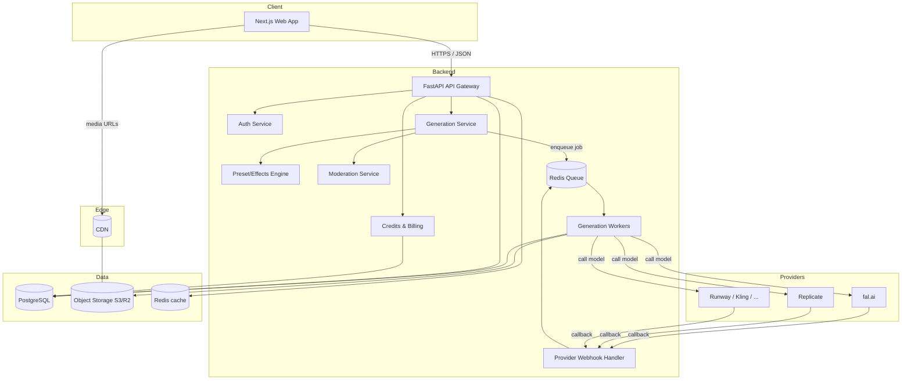

# Architecture — AI Media Generation Platform

This document describes the technical design for a Higgsfield-style platform:
cinematic text/image-to-video, image generation, camera-motion presets,
character consistency, and a social explore feed — built on **hosted model APIs**
behind a provider-agnostic orchestration layer.

Audience: engineers building the system. It is intentionally implementation-ready
but stack-flexible where it can be.

---

## 1. Product surface (what we're cloning)

Mapping the user-visible Higgsfield-style features to system capabilities:

| Product feature                | What it really is, technically                                  |
|--------------------------------|------------------------------------------------------------------|
| Text-to-video                  | Prompt → video provider job                                      |
| Image-to-video                 | Uploaded image + prompt → image-to-video provider job            |
| **Camera-motion presets**      | Named presets that expand into provider params / prompt suffixes |
| Image generation ("Soul"-like) | Prompt (+ refs) → image provider job                             |
| Character / avatar consistency | Reference images + identity adapters provided by the model API   |
| Lipsync / talking avatar       | Audio + portrait → talking-head provider job                     |
| Templates / "effects"          | Curated preset + model + default params bundles                  |
| Explore feed                   | Public gallery of opted-in generations                           |
| Credits / subscription         | Metered billing tied to per-job provider cost                    |

The **preset/effects system** is the product moat here — the underlying models
are commodities reachable by API, so the differentiation is curation, UX, speed,
and reliable orchestration.

---

## 2. High-level architecture



**Why async:** video generation takes seconds to minutes. The HTTP request that
starts a generation must return immediately with a `job_id`; results arrive via
provider webhooks (preferred) or polling, and reach the client via WebSocket/SSE
or short-poll.

---

## 3. Components

### 3.1 Frontend — Next.js (App Router)
- **Studio**: prompt box, image upload, model picker, **preset gallery**, param
  controls (duration, aspect ratio, seed, motion strength), cost-in-credits preview.
- **Jobs/Results**: live job status (queued → running → done/failed), result
  player, download, "remix", publish-to-feed toggle.
- **Explore feed**: infinite gallery of public generations with the preset used.
- **Account**: auth, credit balance, billing/portal, asset library.
- Talks only to our backend; never holds provider API keys.
- Real-time updates via **SSE/WebSocket** channel keyed by `job_id`.

### 3.2 API Gateway — FastAPI
- REST (OpenAPI-documented) + a WebSocket/SSE endpoint.
- Responsibilities: authN/Z, request validation, rate limiting, credit
  pre-authorization, enqueue, status reads.
- Stateless and horizontally scalable; no model calls happen here.

### 3.3 Generation Service
The orchestration core. For a request it:
1. Resolves the **preset** → concrete `(provider, model, params)`.
2. Runs **input moderation** (text + uploaded image).
3. **Pre-authorizes credits** (estimate cost, hold balance).
4. Creates a `Job` row (`status=queued`) and enqueues it.
5. Returns `job_id` immediately.

### 3.4 Provider Adapter Layer  ← critical abstraction
A uniform interface so the rest of the system is provider-agnostic and we can
route, fail over, and price-compare across vendors.

```python
class GenerationProvider(Protocol):
    name: str
    def estimate_cost(self, req: NormalizedRequest) -> Credits: ...
    async def submit(self, req: NormalizedRequest) -> ProviderJobRef: ...
    async def poll(self, ref: ProviderJobRef) -> ProviderStatus: ...
    def parse_webhook(self, payload: dict) -> ProviderStatus: ...
    # returns hosted asset URLs + metadata on completion
```

Adapters: `FalAdapter`, `ReplicateAdapter`, `RunwayAdapter`, `KlingAdapter`, …
A **router** chooses an adapter per request based on the preset's target model,
availability, and cost, with optional failover to an equivalent model.

### 3.5 Preset / Effects Engine
The product's signature layer. A preset is **declarative config**, not code:

```yaml
# presets/crash_zoom.yaml
id: crash_zoom
label: "Crash Zoom"
category: camera-motion
capability: image_to_video
target:
  primary:  { provider: fal,      model: "kling-video/v1.6/pro" }
  fallback: { provider: replicate, model: "minimax/video-01" }
defaults:
  duration_s: 5
  aspect_ratio: "9:16"
params:                      # mapped into provider-native params
  camera_motion: "zoom_in_fast"
prompt_suffix: ", rapid crash zoom, cinematic, dynamic motion blur"
credit_cost: 12
```

The engine validates a preset against the chosen capability, merges user
overrides (within allowed ranges), and emits a `NormalizedRequest`. New
"effects" ship as config + a thumbnail — no deploy of core logic.

### 3.6 Generation Workers
- Celery/Arq workers consuming the queue.
- Per job: call adapter `submit`; await webhook **or** poll with backoff until
  timeout; on success download/copy result to **our** object storage (don't hot-link
  provider URLs — they expire); write `Job.status=succeeded`, attach `Asset`s;
  emit real-time event; **settle credits** (capture hold; refund on failure).
- Idempotent and retry-safe (provider job ref dedupes).

### 3.7 Webhook Handler
- Verifies provider signatures, maps callback → internal job, hands off to the
  worker/finalizer. Reconciliation sweep catches missed webhooks via polling.

### 3.8 Credits & Billing — Stripe
- **Subscriptions** (monthly credit allotment) + **credit packs** (one-off).
- Ledger model: every generation writes a credit transaction; balance is a
  derived/cached sum. Holds (pre-auth) → capture/refund on job settle.
- Stripe webhooks reconcile payments. Per-job **provider cost** recorded next to
  credit charge for margin reporting.

### 3.9 Moderation Service — see §9.

---

## 4. Core data model (PostgreSQL)

```
users(id, email, auth_provider, created_at, ...)
credit_accounts(user_id, balance_cached, updated_at)
credit_transactions(id, user_id, job_id, delta, type[grant|hold|capture|refund|purchase], created_at)
subscriptions(id, user_id, stripe_sub_id, plan, status, period_end)

presets(id, label, category, capability, config_json, credit_cost, is_active)

jobs(
  id, user_id, preset_id, capability,
  provider, model, normalized_request_json,
  provider_job_ref, status[queued|running|succeeded|failed|canceled],
  credit_hold_id, provider_cost_cents, error_code,
  created_at, started_at, finished_at
)

assets(id, job_id, user_id, kind[video|image|audio], storage_key, cdn_url,
       width, height, duration_s, thumbnail_key, is_public, created_at)

feed_items(id, asset_id, user_id, preset_id, likes, published_at)   -- explore
moderation_events(id, subject_type, subject_id, verdict, reason, provider, created_at)
```

Indexes that matter: `jobs(user_id, status, created_at)`, `assets(user_id, is_public)`,
`credit_transactions(user_id, created_at)`, `feed_items(published_at desc)`.

---

## 5. Key request flow — "generate a video"

```mermaid
sequenceDiagram
    participant U as Web
    participant API as FastAPI
    participant GEN as Generation Svc
    participant Q as Queue
    participant W as Worker
    participant P as Provider
    participant S as Storage

    U->>API: POST /generations {preset_id, prompt, image, params}
    API->>GEN: validate + resolve preset
    GEN->>GEN: input moderation
    GEN->>GEN: estimate cost + HOLD credits
    GEN-->>API: 202 {job_id, status: queued}
    API-->>U: job_id  (open SSE channel)
    GEN->>Q: enqueue(job)
    Q->>W: deliver job
    W->>P: submit(normalized request)
    P-->>W: provider_job_ref (async)
    Note over W,P: await webhook OR poll w/ backoff
    P-->>W: completed + asset URLs
    W->>S: copy assets to our storage + thumbnail
    W->>W: output moderation
    W->>API: job succeeded (event)
    API-->>U: SSE: status=succeeded, asset urls
    W->>W: capture credit hold; record provider cost
```

Failure path: provider error/timeout/moderation-block → `status=failed`, credit
hold **refunded**, typed `error_code` surfaced to UI.

---

## 6. API surface (initial)

```
POST   /v1/generations          # start a job (body: preset_id, inputs, params)
GET    /v1/generations/{id}     # status + results
GET    /v1/generations          # list user's jobs (paginated)
DELETE /v1/generations/{id}     # cancel if cancelable
GET    /v1/sse/generations/{id} # real-time status stream

GET    /v1/presets              # browse presets/effects (filter by capability)
GET    /v1/presets/{id}

POST   /v1/assets/upload-url    # presigned upload for input images/audio
GET    /v1/feed                 # explore feed (paginated)
POST   /v1/feed/{asset_id}      # publish own asset to feed

GET    /v1/me                   # profile + credit balance
POST   /v1/billing/checkout     # Stripe checkout session
POST   /v1/billing/webhook      # Stripe -> us
POST   /v1/providers/webhook/{provider}  # provider -> us
```

---

## 7. Scaling & reliability
- **API** and **workers** scale independently; workers scale with queue depth.
- Separate queues/pools per capability (image vs video) — wildly different
  latencies; isolate so fast image jobs aren't stuck behind slow video jobs.
- **Backpressure**: per-user concurrency caps + global provider rate limits.
- **Failover**: preset `fallback` target used when primary provider errors/rate-limits.
- **Reconciliation** cron sweeps stuck `running` jobs (missed webhooks).
- **Idempotency keys** on `POST /generations` to dedupe client retries.

---

## 8. Security
- Provider API keys live **only** in backend secrets (Vault/SSM); never shipped to client.
- Presigned, scoped, expiring URLs for all uploads/downloads.
- Verify **provider + Stripe webhook signatures**; reject unsigned.
- Per-user + per-IP rate limits; auth via OAuth/OIDC (e.g. Auth.js + backend JWT).
- Tenant isolation: every asset/job query scoped by `user_id`.

---

## 9. Content moderation & policy (mandatory, not optional)
Because we relay user content to third-party providers and host outputs publicly,
moderation is a core subsystem, not a nice-to-have:

- **Input moderation**: text classifier + image classifier (e.g. a hosted
  moderation API) before any provider call. Block disallowed categories.
- **Identity/likeness safeguards**: image-to-video and avatar features are the
  highest-risk surface (non-consensual likeness, deepfakes). Gate face/identity
  features, require consent affirmations, and watermark/track provenance
  (e.g. C2PA) on outputs.
- **Output moderation**: re-check returned media before it can be published to
  the feed.
- **Per-provider ToS**: each adapter documents and enforces its provider's
  content policy; we cannot send a provider traffic its ToS forbids.
- **Audit**: `moderation_events` table records every verdict for appeals/compliance.

This is also a legal requirement in most jurisdictions for a platform hosting
user-generated and AI-generated media — budget for it in v1, not "later".

---

## 10. Cost model
- Each preset has a `credit_cost`; each provider call has a real `provider_cost`.
- Worker records actual provider cost per job → **margin = credits_revenue −
  provider_cost** is reportable per preset/model/user.
- Use this to price credits and to **route to the cheapest acceptable provider**
  for a given preset.

---

## 11. Explicit non-goals (this design)
- No model training, fine-tuning, or self-hosted GPU inference.
- No bypassing or removing provider safety controls — we operate **within**
  each provider's policy.
- No mobile-native apps in v1 (responsive web first).

---

## 12. Open decisions (need input as we build)
1. **Auth**: Auth.js (NextAuth) vs Clerk/WorkOS vs custom OIDC?
2. **Queue**: Celery (mature) vs Arq (async-native, lighter)?
3. **Object store**: Cloudflare R2 (no egress fees, great for media) vs AWS S3?
4. **First providers**: fal.ai + Replicate to start? Which flagship video model?
5. **Monorepo tooling**: Turborepo + uv/poetry, or keep web/api fully separate?

See [`docs/ROADMAP.md`](docs/ROADMAP.md) for the phased build plan.
